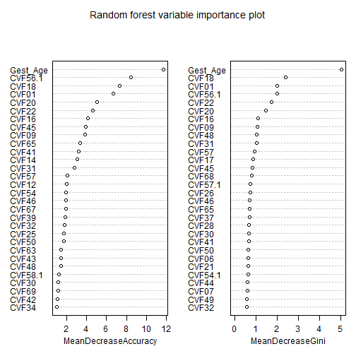
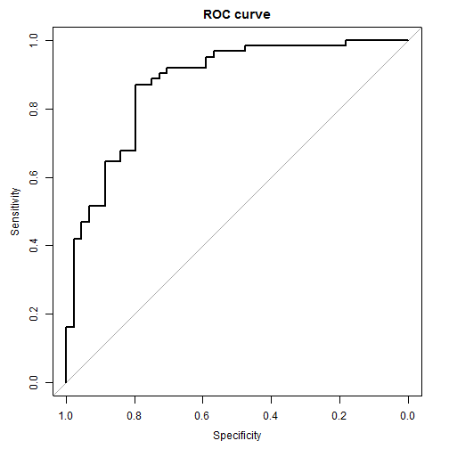

Practice with ROC Curves
========================
Last updated 2014-03-28 21:33:33 using R version 3.0.2 (2013-09-25).

Objective
---------

> From: Jodi Lapidus  
> Sent: Tuesday, February 25, 2014 6:08 PM  
> To: Rajani Kaimal; Stephanie Renfro; Lorie Jacob; Jonah Todd-Geddes; Jian Shen; Ying Wang; Zunqiu Chen; Katrina Ramsey; Sheila Markwardt  
> Subject: Practice with ROC curves - R&C  
> 
> This is an assignment for Rajani... but the rest of you should feel free to
> play around with this dataset so you become familiar with the add-on modules
> for Stata you downloaded from Pepe's site, as well as concepts we started
> discussing last week in class.
> 
> * Instructions:  Attached  is a Stata data (also Excel) file that contains information on 106 women who presented in preterm labor at various clinical sites around the US.  All women were between 22 weeks (0 days) and 36 weeks (6 days) gestation at enrollment.  All  women were suspected of having an intraamniotic infection (IAI) upon enrollment. Some women in this set indeed had IAI, and others did not -- however, all women in this set were "high risk" for complications of some sort, and therefore their newborns were at risk for neonatal morbidity/mortality.   Reminder: Neonatal period = first 28 days of life. 
> * You will examine an index of composite neonatal morbidity as an outcome variable of interest.  This is defined as described in Table 1 of the article by Mercer et al.  In the data file the field is called composite_neomorb, and 1=yes and 2=no.  You might have to recode this for some analyses, such as logistic regression. 
> * Other data fields include a subject ID number, the gestational age at enrollment (gest_age) and at delivery (birth_age), as well as a variable that corresponds to # days between enrollment and delivery (days_dc).  All other fields are called CVFxx  where xx is just a number between 1 and 70.  These are cervical vaginal fluid (CVF) protein concentrations (log-transformed) measured at the time of entry into the study. 
> * Your assignment is to come up with a multimarker prediction model for composite neonatal morbidity based on a subset of these 70 CVF proteins, as well as gestational age at enrollment (if it helps).   
> * Examine the ROC curves for various combinations, as well as some of the other metrics we have discussed in class such as area under ROC, partial area under ROC, and TPF for a specific value of FPF.   Compare/contrast the results you find with ROC with the associations (odds ratios) and their tests of significance. 
> * Summarize your methods and results in a few paragraphs along with supporting tables and figures


Let's do this
-------------

Read Excel data file.


```r
f <- "cvf_neomorb.csv"
d <- read.csv(f)
str(d)
```

```
## 'data.frame':	106 obs. of  85 variables:
##  $ Subjid2          : int  1002 1003 1006 1007 1008 1009 1010 1012 1014 3001 ...
##  $ Gest_Age         : num  22.9 30.7 31.7 33.1 33.6 ...
##  $ Day_Dc           : int  1 20 2 49 0 4 40 1 31 2 ...
##  $ Birth_Age        : num  23 33.6 32 40.1 33.6 ...
##  $ CVF01            : num  4.87 2.71 1.79 1.72 1.86 ...
##  $ CVF02            : num  2.62 2.65 1.96 6.8 6.94 ...
##  $ CVF03            : num  1.361 1.343 0.997 5.112 5.273 ...
##  $ CVF04            : num  6.01 6.22 4.81 5.87 6 ...
##  $ CVF05            : num  8.58 9.14 8.11 8.22 7.1 ...
##  $ CVF06            : num  -0.331 -0.315 -1.118 -1.024 -0.494 ...
##  $ CVF07            : num  4.64 6.34 5.72 4.69 5.92 ...
##  $ CVF08            : num  7.89 7.42 4.67 6.3 6.46 ...
##  $ CVF09            : num  2.3 3.52 2.89 2.02 3.16 ...
##  $ CVF10            : num  0.322 1.569 1.511 0.693 0.747 ...
##  $ CVF11            : num  4.44 8.21 5.48 6.93 6.42 ...
##  $ CVF12            : num  4.72 4.09 3.71 4.98 5.41 ...
##  $ CVF13            : num  7.3 7.51 5.05 6.04 5.82 ...
##  $ CVF14            : num  8.59 8.09 3.93 6.51 4.93 ...
##  $ CVF15            : num  12.8 12.2 11.8 12.2 13.3 ...
##  $ CVF16            : num  5.97 7.76 3.22 5.77 5.49 ...
##  $ CVF17            : num  11.13 10.45 7.99 9.34 8.51 ...
##  $ CVF18            : num  7.98 6.76 6.56 5.68 6.79 ...
##  $ CVF19            : num  10.87 9.96 8.03 9.31 8.95 ...
##  $ CVF20            : num  9.77 10.78 7.47 7.99 9.95 ...
##  $ CVF21            : num  7.31 7.56 7.66 6.72 7.07 ...
##  $ CVF22            : num  2.56 4.84 3.54 2.45 3.9 ...
##  $ CVF23            : num  4.39 4.68 3.2 3.54 3.37 ...
##  $ CVF24            : num  0.92 0.802 -0.724 -0.519 -1.008 ...
##  $ CVF25            : num  8.71 8.7 7.59 9.16 8.82 ...
##  $ CVF26            : num  2.625 2.303 0.742 2.442 2.054 ...
##  $ CVF27            : num  -1.77 1.22 -1.77 2.16 2.8 ...
##  $ CVF28            : num  5.46 3.23 2.54 4.25 2.83 ...
##  $ CVF29            : num  0.875 0.833 -0.58 1.386 1.281 ...
##  $ CVF30            : num  -2.659 -0.844 -1.238 -0.528 -1.427 ...
##  $ CVF31            : num  4.35 4.79 3.81 3.23 5.74 ...
##  $ CVF32            : num  5.99 5.95 3.02 6.09 5.08 ...
##  $ CVF33            : num  1.87 5.94 2.96 2.13 2.33 ...
##  $ CVF34            : num  7.78 8.15 7.14 7.57 8.17 ...
##  $ CVF35            : num  6.35 5.67 4.19 6.91 7.56 ...
##  $ CVF36            : num  3.1 5.41 4.66 7.47 5.81 ...
##  $ CVF37            : num  6.92 6.99 4.63 6.45 5.92 ...
##  $ CVF38            : num  4.58 4.74 3.31 4.4 4.16 ...
##  $ CVF39            : num  4.03 2.3 3.76 4.8 2.3 ...
##  $ CVF40            : num  2.64 4.18 2.64 5.32 6.26 ...
##  $ CVF41            : num  3.35 3.55 1.77 2.67 4.02 ...
##  $ CVF42            : num  7.29 7.5 6.37 6.29 6.15 ...
##  $ CVF43            : num  0.993 2.425 1.163 0.788 2.028 ...
##  $ CVF44            : num  4.85 4.33 2.66 3.48 2.3 ...
##  $ CVF45            : num  1.308 0.405 -1.966 0.336 0.742 ...
##  $ CVF46            : num  7.15 4.62 2.69 5.63 5.5 ...
##  $ CVF47            : num  2.43 2.07 1.99 4.17 2.5 ...
##  $ CVF48            : num  -0.968 2.526 2.059 2.26 1.25 ...
##  $ CVF49            : num  5.71 6.43 6.41 6 6.17 ...
##  $ CVF50            : num  2.912 2.058 1.332 0.829 0.642 ...
##  $ CVF51            : num  3.4 6.57 4.16 6.48 5.44 ...
##  $ CVF52            : num  3.4 5.17 6.53 6.29 5.51 ...
##  $ CVF53            : num  -1.35 -1.43 -2.47 3.42 3.15 ...
##  $ CVF54            : num  -1.1394 0.5306 1.3083 0.9555 0.0953 ...
##  $ CVF55            : num  3.57 4.58 3.96 5.55 4.51 ...
##  $ CVF56            : num  0.262 0.336 -0.693 -1.273 -0.693 ...
##  $ CVF57            : num  8.26 8.77 7.85 8 8.09 ...
##  $ CVF58            : num  1.668 -0.616 -1.187 -1.309 -0.616 ...
##  $ CVF49.1          : num  4.93 4.64 4.55 4.82 6.65 ...
##  $ CVF50.1          : num  0.531 2.186 0.693 0.642 0.336 ...
##  $ CVF51.1          : num  2.51 2.93 2.38 2.16 2.07 ...
##  $ CVF52.1          : num  8.17 7.73 6.88 9.21 7.51 ...
##  $ CVF53.1          : num  4.44 5.43 4.49 5.12 6.14 ...
##  $ CVF54.1          : num  5.01 6.58 5.72 5.34 6.5 ...
##  $ CVF55.1          : num  4.97 3.78 4.37 3.73 6.34 ...
##  $ CVF56.1          : num  5.9 4.2 3.81 3.94 7.9 ...
##  $ CVF57.1          : num  4.42 3.87 6.03 3.68 5.15 ...
##  $ CVF58.1          : num  8.22 6.42 5.65 7.75 6.39 ...
##  $ CVF59            : num  2.19 2.19 2.19 2.19 2.19 ...
##  $ CVF60            : num  1.61 7.48 5.42 7.38 5.77 ...
##  $ CVF61            : num  2.57 6.83 3.94 7.95 7.25 ...
##  $ CVF62            : num  14.6 14.8 11.6 14.1 12.6 ...
##  $ CVF63            : num  2.94 3.94 2.79 4.48 3.72 ...
##  $ CVF64            : num  9.48 9.46 9.03 9.86 9.28 ...
##  $ CVF65            : num  7.35 8.88 9.03 8.32 7.35 ...
##  $ CVF66            : num  15.8 15.3 13.1 15.1 12.8 ...
##  $ CVF67            : num  5.07 4.36 4.36 4.68 4.36 ...
##  $ CVF68            : num  7.19 7.57 6.91 6.95 6.21 ...
##  $ CVF69            : num  8.13 8.35 6.84 7.7 6.78 ...
##  $ CVF70            : num  7.61 7.3 5.87 6.54 5.32 ...
##  $ Neomorb_Composite: int  1 2 1 2 1 2 2 1 2 1 ...
```


Make `Neomorb_Composite` a factor variable.


```r
d$Neomorb_Composite <- factor(d$Neomorb_Composite, labels = c("Yes", "No"))
table(d$Neomorb_Composite, unclass(d$Neomorb_Composite))
```

```
##      
##        1  2
##   Yes 44  0
##   No   0 62
```


Make a vector of variable names for the cervical vaginal fluid (CVF) protein concentration variables.


```r
xVarNames <- names(d)[grep("^CVF", names(d))]
xVarNames <- c("Gest_Age", xVarNames)
xVars <- paste(xVarNames, collapse = " + ")
```


Create a formula object to be used in the model fitting.


```r
f <- paste("Neomorb_Composite", xVars, sep = " ~ ")
f <- formula(f)
f
```

```
## Neomorb_Composite ~ Gest_Age + CVF01 + CVF02 + CVF03 + CVF04 + 
##     CVF05 + CVF06 + CVF07 + CVF08 + CVF09 + CVF10 + CVF11 + CVF12 + 
##     CVF13 + CVF14 + CVF15 + CVF16 + CVF17 + CVF18 + CVF19 + CVF20 + 
##     CVF21 + CVF22 + CVF23 + CVF24 + CVF25 + CVF26 + CVF27 + CVF28 + 
##     CVF29 + CVF30 + CVF31 + CVF32 + CVF33 + CVF34 + CVF35 + CVF36 + 
##     CVF37 + CVF38 + CVF39 + CVF40 + CVF41 + CVF42 + CVF43 + CVF44 + 
##     CVF45 + CVF46 + CVF47 + CVF48 + CVF49 + CVF50 + CVF51 + CVF52 + 
##     CVF53 + CVF54 + CVF55 + CVF56 + CVF57 + CVF58 + CVF49.1 + 
##     CVF50.1 + CVF51.1 + CVF52.1 + CVF53.1 + CVF54.1 + CVF55.1 + 
##     CVF56.1 + CVF57.1 + CVF58.1 + CVF59 + CVF60 + CVF61 + CVF62 + 
##     CVF63 + CVF64 + CVF65 + CVF66 + CVF67 + CVF68 + CVF69 + CVF70
```


Load packages.


```r
packages <- c("randomForest", "pROC")
sapply(packages, require, character.only = TRUE, quietly = TRUE)
```

```
## Warning: package 'randomForest' was built under R version 3.0.3
```

```
## randomForest 4.6-7 Type rfNews() to see new features/changes/bug fixes.
```

```
## Warning: package 'pROC' was built under R version 3.0.3
```

```
## Type 'citation("pROC")' for a citation.
## 
## Attaching package: 'pROC'
## 
## The following objects are masked from 'package:stats':
## 
## cov, smooth, var
```

```
## randomForest         pROC 
##         TRUE         TRUE
```


Use a random forest to generate a set of important predictors.


```r
m1 <- randomForest(f, data = d, importance = TRUE, proximity = TRUE)
m1
```

```
## 
## Call:
##  randomForest(formula = f, data = d, importance = TRUE, proximity = TRUE) 
##                Type of random forest: classification
##                      Number of trees: 500
## No. of variables tried at each split: 9
## 
##         OOB estimate of  error rate: 23.58%
## Confusion matrix:
##     Yes No class.error
## Yes  27 17      0.3864
## No    8 54      0.1290
```

```r
varImpPlot(m1, main = "Random forest variable importance plot")
```

 

```r
m1Imp <- data.frame(importance(m1))
tail(m1Imp[order(m1Imp$MeanDecreaseAccuracy, decreasing = TRUE), ])
```

```
##           Yes      No MeanDecreaseAccuracy MeanDecreaseGini
## CVF36 -3.2202  0.9536               -1.763          0.29463
## CVF58 -1.8402 -1.0370               -1.801          0.09171
## CVF33 -0.8666 -1.6772               -1.981          0.26260
## CVF05 -2.6833 -1.2288               -2.254          0.39469
## CVF53 -2.7510 -0.8180               -2.283          0.36849
## CVF07 -2.3811 -0.8908               -2.498          0.58779
```


Find the cutoff, the *absolute value of the lowest negative-scoring variable*, [ref: Random forests for categorical dependent variables: an informal quick start R guide](http://www.stanford.edu/~stephsus/R-randomforest-guide.pdf)


```r
cutoff <- abs(min(m1Imp[m1Imp$MeanDecreaseAccuracy < 0, "MeanDecreaseAccuracy"]))
cutoff
```

```
## [1] 2.498
```


Get the variables identified from the random forest with mean decrease in accuracy > 2.4977.


```r
xSubset <- m1Imp[m1Imp$MeanDecreaseAccuracy > cutoff, ]
xSubset <- xSubset[order(xSubset$MeanDecreaseAccuracy, decreasing = TRUE), ]
xSubset
```

```
##              Yes      No MeanDecreaseAccuracy MeanDecreaseGini
## Gest_Age  8.8446 10.5691               11.714           5.0306
## CVF56.1   4.9874  7.5892                8.454           1.9874
## CVF18     5.4799  6.3284                7.348           2.3882
## CVF01     7.1117  2.5997                6.693           1.9952
## CVF20     3.6711  4.3166                5.079           1.4410
## CVF22     5.5213  1.6760                4.643           1.7176
## CVF16     2.3851  2.7602                4.104           1.1025
## CVF45     1.9242  3.3045                3.946           0.8285
## CVF09     3.8408  0.8759                3.854           1.0394
## CVF65     1.2568  2.4226                3.343           0.6767
## CVF41     2.1780  2.8159                3.205           0.6494
## CVF14    -0.3271  3.9843                3.093           0.5317
## CVF31     1.8154  2.2354                2.772           1.0218
```

```r
xSubset <- rownames(xSubset)
```


Pass this subset of x variables to `glm`.


```r
f <- paste("Neomorb_Composite", paste(xSubset, collapse = " + "), sep = " ~ ")
f <- formula(f)
f
```

```
## Neomorb_Composite ~ Gest_Age + CVF56.1 + CVF18 + CVF01 + CVF20 + 
##     CVF22 + CVF16 + CVF45 + CVF09 + CVF65 + CVF41 + CVF14 + CVF31
```

```r
m2 <- glm(f, data = d, family = binomial)
summary(m2)
```

```
## 
## Call:
## glm(formula = f, family = binomial, data = d)
## 
## Deviance Residuals: 
##    Min      1Q  Median      3Q     Max  
## -2.397  -0.528   0.314   0.660   2.448  
## 
## Coefficients:
##              Estimate Std. Error z value Pr(>|z|)  
## (Intercept) -8.268157   5.137557   -1.61    0.108  
## Gest_Age     0.234179   0.098022    2.39    0.017 *
## CVF56.1     -0.080575   0.224435   -0.36    0.720  
## CVF18       -0.451238   0.382984   -1.18    0.239  
## CVF01       -0.244310   0.423796   -0.58    0.564  
## CVF20       -0.494044   0.332152   -1.49    0.137  
## CVF22       -0.056292   0.768984   -0.07    0.942  
## CVF16        0.197608   0.301126    0.66    0.512  
## CVF45        0.331743   0.362139    0.92    0.360  
## CVF09        1.147062   1.372998    0.84    0.403  
## CVF65        0.758642   0.483162    1.57    0.116  
## CVF41        0.229498   0.267759    0.86    0.391  
## CVF14       -0.140306   0.246868   -0.57    0.570  
## CVF31        0.000878   0.331316    0.00    0.998  
## ---
## Signif. codes:  0 '***' 0.001 '**' 0.01 '*' 0.05 '.' 0.1 ' ' 1
## 
## (Dispersion parameter for binomial family taken to be 1)
## 
##     Null deviance: 143.876  on 105  degrees of freedom
## Residual deviance:  89.941  on  92  degrees of freedom
## AIC: 117.9
## 
## Number of Fisher Scoring iterations: 5
```


Plot an ROC curve.


```r
plot(roc(d$Neomorb_Composite, predict(m2)), main = "ROC curve")
```

 

```
## 
## Call:
## roc.default(response = d$Neomorb_Composite, predictor = predict(m2))
## 
## Data: predict(m2) in 44 controls (d$Neomorb_Composite Yes) < 62 cases (d$Neomorb_Composite No).
## Area under the curve: 0.874
```

